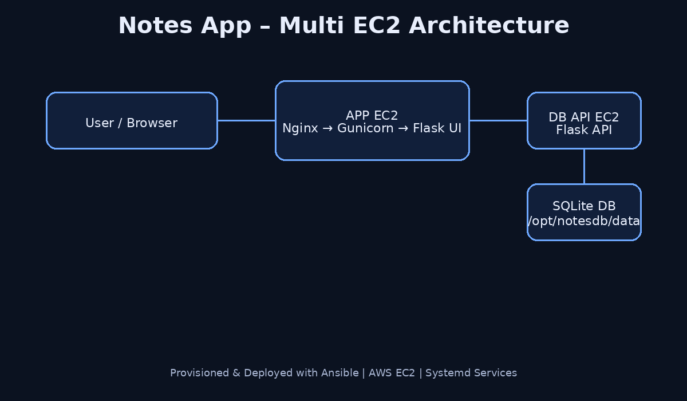

# 📝 Notes App – Multi EC2 Deployment with Ansible


A **production-style DevOps project** demonstrating how to deploy a simple Notes application across **multiple AWS EC2 instances** using **Ansible**, following best practices for service separation, automation, and verification.

---

## 🧱 Architecture Overview



### Components

| Component | Description |
|---------|-------------|
| Control Node | Runs Ansible playbooks |
| APP EC2 | Flask UI + Gunicorn + Nginx |
| DB EC2 | Flask REST API + SQLite |
| Network | Private IP communication |

---

## 🚀 Quick Start

```bash
git clone https://github.com/fadyy2k/notesapp-multi-ec2-ansible.git
cd notesapp-multi-ec2-ansible
```

### Update Inventory

```bash
nano inventory/hosts
```

```ini
[app]
notesapp-app ansible_host=APP_PRIVATE_IP

[db]
notesapp-db ansible_host=DB_PRIVATE_IP
```

### Deploy Database API

```bash
ansible-playbook playbook-db.yml
```

### Deploy Application UI

```bash
ansible-playbook playbook-app.yml
```

Open:
```
http://APP_PUBLIC_IP/
```

---

## 🧰 Tech Stack

- AWS EC2
- Ansible
- Flask
- Gunicorn
- Nginx
- SQLite

---

## 🧪 API Examples

See full API usage here:

➡️ **API_EXAMPLES.md**

---

## 💾 Data Persistence

- SQLite database stored at:
  ```
  /opt/notesdb/data/notes.db
  ```
- Persists across restarts and deployments

---

## 🔍 Health Checks

```bash
curl http://DB_PRIVATE_IP:5000/health
```

```bash
systemctl status notesapp
systemctl status nginx
```

---

## 🔐 Security Notes

- No authentication (demo purpose)
- Nginx reverse proxy
- For production:
  - HTTPS
  - Auth (JWT / OAuth)
  - Secrets manager

---

## 📂 Repository Structure

```
notesapp-multi-ec2-ansible/
├── inventory/
├── roles/
├── playbook-app.yml
├── playbook-db.yml
├── architecture.png
├── API_EXAMPLES.md
└── README.md
```

---

## 🎯 Learning Outcomes

- Multi-EC2 architecture
- Ansible automation
- Systemd services
- Flask production deployment
- Nginx reverse proxy

---

## 👤 Author

**Fady Mounir**  
GitHub: https://github.com/fadyy2k

⭐ Star the repo if you find it useful!
